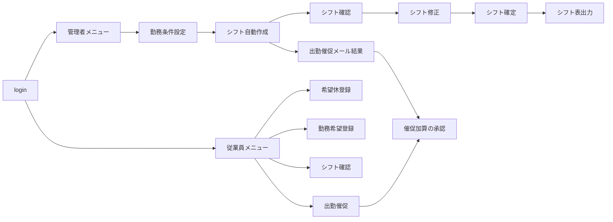

# らくらくシフト登録 画面プロトタイプ（HTML/CSS）ユースケース準拠版

ユースケース記述（207-3、改訂版・16件）とプロジェクト計画書をもとに作成した静的プロトタイプです。
JavaScript は使っていません。ダイアログ・代替フローの表示は CSS の `:target`、日付のタップ選択は CSS のチェックボックスで動きます。

## VS Code での開き方
1. VS Code で `rakuraku-shift` フォルダを開く
2. 拡張機能「Live Server」を入れる
3. `login.html` を右クリック →「Open with Live Server」
4. 「管理者として入る」「従業員として入る」から各メニュー画面へ

**代替フローの確認**：各画面の下の「代替フローの表示確認」のリンクを押すと、エラー・警告メッセージが上部に表示されます（例：ログインの認証失敗、シフト確定のエラー）。

## ユースケースと画面の対応

| ユースケース | アクター | 画面（基本フローの順） | 代替フローの表示 |
|---|---|---|---|
| ログイン | 管理者・従業員 | login.html → admin/menu.html／employee/menu.html | 認証失敗、未入力 |
| ログアウト | 管理者・従業員 | 各画面の「ログアウト」→ login.html | — |
| 従業員登録 | 管理者 | employee-new → employee-registered（登録情報） | 必須未入力、入力誤り |
| 従業員情報変更 | 管理者 | employee-list → employee-edit → employee-updated | 入力誤り |
| 従業員削除 | 管理者 | employee-list → employee-delete（確認）→ employee-deleted | キャンセル（一覧へ戻る） |
| CSV取込 | 管理者 | employee-import → employee-import-check → employee-import-result | CSV以外、形式不一致、エラー行・重複行 |
| 希望休登録 | 従業員 | request-off → request-off-done | 登録できない日、入力誤り |
| 勤務希望登録 | 従業員 | request-work → request-work-done | 入力誤り |
| 勤務条件設定 | 管理者 | conditions → conditions-done | 未入力、最低>最大、連勤上限不正、確定済み |
| シフト自動作成 | 管理者 | shift-generate（結果と不足枠を表示） | 情報不足、警告、不足枠 |
| 出勤催促メール | システム・従業員・管理者 | reminder-log（送信結果と履歴） | 送信失敗、対象なし、メール未登録 |
| 催促加算（給与アップ） | 従業員・管理者 | employee/offer → offer-done、admin/allowance（承認） | 受付終了、勤務条件違反、却下 |
| シフト確認 | 管理者・従業員 | admin/shift-view、employee/shift | シフト未作成 |
| シフト修正 | 管理者 | shift-edit（セルを選ぶ）→ shift-edit-done | 修正内容に問題 |
| シフト確定 | 管理者 | shift-confirm → shift-confirmed | 問題があり確定できない |
| シフト表出力 | 管理者 | shift-export | 作成できない |

## フォルダ構成
```
rakuraku-shift/
├─ login.html
├─ css/style.css            共通スタイル
├─ admin/                   管理者の画面（21画面）
└─ employee/                従業員の画面（スマホ優先・8画面）
```

## 画面遷移（主な流れ）


## ユースケースから読み取り、画面に反映した点
- 出勤催促メールは、シフト自動作成で人数が足りないときに**システムが自動送信**します。管理者は送信結果を確認し、失敗時は再送します。
- 従業員が出勤催促に応じると、**その場でシフトに追加**され、加算は承認待ちで記録されます。管理者が承認すると確定し、却下もできます。
- 加算額は**勤務条件設定で入力**します（1回あたりの金額）。
- 従業員の削除は、削除確認画面を挟みます。

## 仮に置いた前提（ユースケースに書かれていないため要確認）
- 従業員登録の入力項目：氏名、フリガナ、区分、入社日、メールアドレス、パスワード、スキル、勤務できる曜日・時間帯、勤務上限
- 勤務希望登録は「働きたい日をタップ＋時間帯（早番・遅番・どちらでも）」の形にしています。
- シフト表出力のファイル形式（Excel／CSV／PDF）
- シフト確定で「問題がある」とする条件。本画面では、連勤上限超えがあれば確定できない想定でエラーを出し、人数不足は警告のみとしています。
- 従業員削除後の、過去シフトの名前の扱い（計画書は「利用停止」で履歴を残す想定）
- 権限管理・操作記録は、ユースケースにないため画面に含めていません。
- サンプルデータ（従業員名、時間帯、必要人数、加算額1,600円）は仮の値です。後ほど差し替えてください。
